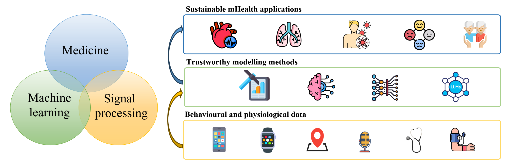

 
>Genuis only means hard-working all one's life.\
>                                                 --Mendeleyev
 
 
 
Hi there! My name is Tong Xia, and I am a postdoctoral research associate in the Department of Computer Science and Technology at the University of Cambridge, UK, where I got my PhD under the supervision of [Prof. Cecilia Mascolo](https://www.cl.cam.ac.uk/~cm542/). I received my master's degree from the Department of Electronics and Engineering, Tsinghua University, China, in 2020, supervised by [Prof. Yong Li](http://fi.ee.tsinghua.edu.cn/~liyong/). Prior to that, I received my bachelor's degree in Electronic and Information Engineering from Wuhan University, China, in 2017.
 
My research focuses on leveraging data science and machine learning to advance healthcare applications. It spans two primary areas: (1) developing machine learning models for physiological data to enable intelligent precision medicine, and (2) analyzing and mining large-scale health data to improve public health outcomes at the population level.

Key worlds of my studies include respiratory audio, ECG, mobility, geolocations, pandemics, LLMs, foundation models, uncertainty quantification, federated learning, reinforcement learning, and causality.

I am deeply passionate about utilizing AI to build a better future, particularly in healthcare. I aspire for my research to enhance the efficiency, accessibility, and affordability of healthcare services.
  

News
======
• **October 2024**: Our pioneering work on leveraging LLMs for understanding [audio](https://arxiv.org/pdf/2410.05361) and [ECGs](https://arxiv.org/pdf/2409.08788) for healthcare will be presented at the NeurIPS 2024 workshop. \
• **October 2024**: Our work *Towards Open Respiratory Acoustic Foundation Models: Pretraining and Benchmarking* is accepted by Neurips dataset and benchmark track 2024 [pdf](https://arxiv.org/abs/2406.16148) [Github](https://github.com/evelyn0414/OPERA)!  \
• **September 2024**: I have been nominated as a Rising Star in Women in Engineering at the upcoming [Asian Dean's Forum](https://risingstarsasia.org/about.php).  \
• **July 2024**: I gave a seminar at City University of Hong Kong [link](https://www.sdsc.cityu.edu.hk/news-event/seminars/ai-empowered-mhealth-pioneering-applications-and-overcoming-key-challenges).\
• **Feb. 2024**: I gave a guest lecture on Generative AI for mobile health, check from here [pdf](https://www.cl.cam.ac.uk/teaching/2324/MH/Guest-Xia.pdf) \

Awards
======
•	2024, Rising Star in Women in Engineering at the Asian Dean's Forum, Singapore  \
•	2023, Chinese Government Award for Outstanding Self-financed Students Abroad (650 awards globally), UK \
•	2022, 2nd POSTER AWARD in Precision Health Initiative Launch Symposium, Cambridge \
•	2022, Third Place of lntelligent Medical Track in 2022 World Privacy-Preserving Computing Competition (WPPCC 2022) \
•	2022, Best Postgraduate Poster in Oxbridge Women in Computer Science Conference \
•	2022, COVID-19 Sounds project awarded as Better Future Award in Hall of Fame Awards, Cambridge \
•	2021, ISCA INTERSPEECH Student Travel Grant \
•	2020, Overseas PhD Full Scholarship for 2020-2023 \
•	2020, Distinguished Master Thesis Award by the Chinese Institute of Electronics \
•	2020, Outstanding Research Intern, Tencent, Beijing \
•	2019, National Graduate Student Scholarship of China \
•	2016, Intel Cup Embedded System Invitational Contest, National Third Prize \
•	2014, National Undergraduate Student Scholarship of China 

Press
======

Audio AI for health: Cambridge University  [(1)](https://www.cam.ac.uk/research/news/new-app-collects-the-sounds-of-covid-19), [(2)](https://www.cst.cam.ac.uk/news/your-phone-could-tell-us-if-you-have-coronavirus), [(3)](https://www.cst.cam.ac.uk/news/presenting-hall-fame-awards), [(4)](https://www.cst.cam.ac.uk/news/remote-monitoring-successfully-tracks-covid-19-progression-over-time), [BBC](https://www.bbc.co.uk/news/technology-52215290), [The Guardian](https://www.theguardian.com/world/2020/sep/21/what-is-persistent-cough-and-how-to-i-recognise-it-coronavirus-covid), [The Times](https://archive.ph/IRAX1), [Forbes](https://www.forbes.com/sites/marcwebertobias/2020/05/05/ai-and-medical-diagnostics-can-a-smartphone-app-detect-covid-19-from-speech-or-a-cough/#144df95f5436),   [新智元](https://mp.weixin.qq.com/s/xtjl0skrN_KlXDk8CqzAqw), [HyperAI超神经](https://mp.weixin.qq.com/s/pC97usmnzZGzDua7nrXf-g) , 
Geoscience and public health: [时空大数据小组](https://mp.weixin.qq.com/s/EpeAkAsroxsZ86gq90PAJA), [时空实验室](https://mp.weixin.qq.com/s/1wytawD3p8-FMhwVWHNXkw)
Trustworthy AI:  [AI TIMER](https://mp.weixin.qq.com/s/s3ZJuodSNLo1X3IdqtFmMA), [智隐数据星图](https://mp.weixin.qq.com/s/-1vFAxFLrps9K_ss9Mc3BQ)

Academic Service
======
I am a reviewer of \
•	Lancet Regional Health-Europe, Nature Scientific Data, Nature Scientific Reports,  IEEE TNSM, IEEE TMC, ACM TKDD, EPJ data science \
and I also serve as an SPC for \
•	AAAI 2020-2024, UbiComp 2019-2024, KDD 2019-2024, IJCAI 2021-2023, ICASSP 2022-2023, CHIL 2023-2024, ML4H 2024

I am serving as [UbiComp 2022](https://ubicomp.org/ubicomp2022/organizing-committee/) Posters&Demos session chair. \
I am co-organizing [Mobile and Wearable Health Seminar Series](https://talks.cam.ac.uk/show/archive/172414), University of Cambridge, 2023-2024  

Teaching
======
I am also passionate about supervising and I have been a teaching assistant for the following undergraduate courses: 

•  Artificial Intelligence 2022(Part IB, University of Cambridge) \
•  Machine Learning & Real-World Data 2022(Part IA, University of Cambridge) \
•  Foundation of Data Science 2021 (Part IA, University of Cambridge) \
•  AI Research Project 2021, 2022 (China UK Development Centre, Cambridge Centre for the Integration of Science, Technology and Culture) \
•  AI in Medicine Project 2021 (China UK Development Centre, Cambridge Centre for the Integration of Science, Technology, and Culture) 

Mentoring
======
I enjoy collaborating with PhD and thesis students, usually as part of an internship in our lab. Here are some recent research projects I supervised:
•  Yuwei Evelyn Zhang  (University of Cambridge), MPhil dissertation: Exploring uncertainty quantification in federated learning for healthcare, 2022. This student was awarded a commended dissertation award by the department - one of the 4 prizes awarded for dissertations in computer science \
•  Alex Wang (University of Cambridge), Part II dissertation: A holistic evaluation of the quality of uncertainty from Bayesian model ensemble in federated learning, 2022   \

Non-Academic Services
======
Since 2021, I have been a committee member of the UK Tsinghua Alumni Association (UKAT). Since 2022, I have been the leader of the publicity team and managed the official UKTA WeChat public account. In late 2023, I officially became the Vice Secretary-General of UKTA.

<!-- 

**Deep learning for behavioural and physiological data:**
-	Audio-based respiratory and cardiovascular diseases prediction, from early screening [[KDD'20](https://dl.acm.org/doi/pdf/10.1145/3394486.3412865),[NPJ Digital Medicine'22](https://www.nature.com/articles/s41746-021-00553-x), [NeurIPS'21](https://openreview.net/pdf?id=9KArJb4r5ZQ)] to longitudinal minitoring [[JMIR'22](https://www.jmir.org/2022/6/e37004/), [KDD'23](https://dl.acm.org/doi/pdf/10.1145/3580305.3599792)]
-	 Electrocardiogram (ECG) data, particularly those collected by mobile devices, for detecting heart abnormality detection [[JBHI'24](https://ieeexplore.ieee.org/abstract/document/10423104)] and report generation (on-going).
-	 Individual [[UbiComp'18](https://dl.acm.org/doi/abs/10.1145/3191778)] and collective  [[UbiComp'19](https://dl.acm.org/doi/abs/10.1145/3314417), [TKDD'21](https://dl.acm.org/doi/abs/10.1145/3451394), [TKDE'21](https://ieeexplore.ieee.org/abstract/document/8964408)] mobility patterns understanding and prediction. 
-	 LSTM and GCN based mobile app usage modelling and prediction [[UbiComp'20](https://dl.acm.org/doi/abs/10.1145/3411817), [TIST'2020](https://dl.acm.org/doi/abs/10.1145/3408325)].

**Trustworthy AI for human-centric applications:**
- Transformer-based missing data imputation [[AAAI'21](https://ojs.aaai.org/index.php/AAAI/article/view/16577)]. 
- Uncertainty quantification for safty-critial health applications [[INTERSPEECH'21](https://www.isca-archive.org/interspeech_2021/xia21_interspeech.pdf), [CinC'22](https://ieeexplore.ieee.org/abstract/document/10081868),[TKDD'23](https://arxiv.org/abs/2312.02327), [JBHI'24](https://ieeexplore.ieee.org/abstract/document/10423104)]. 
-	Decentrialized and privacy-preserving deep learning for real-world applications [[ICASSP'21](https://ieeexplore.ieee.org/abstract/document/10096427), [KDD'24](https://arxiv.org/abs/2312.02327)].

**Big data and AI for public health:** 
-	Urban environmental factors on public health [[Scientific data'23](https://www.nature.com/articles/s41597-023-02060-y)].
-	Pandemic control and interventions [[BigData'21](https://ieeexplore.ieee.org/abstract/document/9671794), [KDD'22](https://dl.acm.org/doi/abs/10.1145/3534678.3539195)].

To date, I have published over 50 peer-reviewed papers, including 9 in top-tier journals and 13 at CCF A-level conferences. My Google Scholar citations exceed 1600, and my h-index is 19.
Through these projects, I have fostered close collaborations and connections in the industry with companies like Nokia Bell Labs, Tencent, and Huawei Cambridge.

**Deep learning for modelling behavioural and physiological data:**
-	Deep learning for audio signals to predict respiratory and cardiovascular diseases, from early screening [[KDD'20](https://dl.acm.org/doi/pdf/10.1145/3394486.3412865),[NPJ Digital Medicine'22](https://www.nature.com/articles/s41746-021-00553-x), [NeurIPS'21](https://openreview.net/pdf?id=9KArJb4r5ZQ)] to longitudinal minitoring [[JMIR'22](https://www.jmir.org/2022/6/e37004/), [KDD'23](https://dl.acm.org/doi/pdf/10.1145/3580305.3599792)]
-	 Deep learning for electrocardiogram (ECG) data, particularly those collected by mobile devices, for detecting heart abnormalities [[JBHI'24](https://ieeexplore.ieee.org/abstract/document/10423104)].
-	 Data mining and machine learning algorithms to model complex human behaviours like individual [[UbiComp'18](https://dl.acm.org/doi/abs/10.1145/3191778)] and collective  [[UbiComp'19](https://dl.acm.org/doi/abs/10.1145/3314417), [TKDD'21](https://dl.acm.org/doi/abs/10.1145/3451394), [TKDE'21](https://ieeexplore.ieee.org/abstract/document/8964408)] mobility patterns. 
-	 Sequantial deep learning and graph neural networks for app usage behaiour modelling and prediction [[UbiComp'20](https://dl.acm.org/doi/abs/10.1145/3411817), [TIST'2020](https://dl.acm.org/doi/abs/10.1145/3408325)].

**Big data and AI for public health:** 
-	Big data techniques to understand the impact of urban environmental factors on public health [[Scientific data'23](https://www.nature.com/articles/s41597-023-02060-y)].
-	Mobility intervention strategies for pandemic control and devising state-of-the-art intelligent interventions [[BigData'21](https://ieeexplore.ieee.org/abstract/document/9671794), [KDD'22](https://dl.acm.org/doi/abs/10.1145/3534678.3539195)].

**Trustworthy AI for human-centric applications:**
- Data-efficient transformer neural network for humman mobility data generation [[AAAI'21](https://ojs.aaai.org/index.php/AAAI/article/view/16577)]. 
- Uncertainty quantification for safty-critial health applications [[INTERSPEECH'21](https://www.isca-archive.org/interspeech_2021/xia21_interspeech.pdf), [CinC'22](https://ieeexplore.ieee.org/abstract/document/10081868),[TKDD'23](https://arxiv.org/abs/2312.02327), [JBHI'24](https://ieeexplore.ieee.org/abstract/document/10423104)]. 
-	Decentrialized and privacy-preserving machine learning models for real-world applications [[ICASSP'21](https://ieeexplore.ieee.org/abstract/document/10096427), [KDD'24](https://arxiv.org/abs/2312.02327)]. 

To date, I have published over 50 peer-reviewed papers, including 9 in top-tier journals and 13 at CCF A-level conferences. My Google Scholar citations exceed 1500, and my h-index is 18.
Through these projects, I have fostered close collaborations and connections in the industry with companies like Nokia Bell Labs, Tencent, and Huawei Cambridge.

I am interested in data mining, machine learning, deep learning, and all kinds of artificial intelligence technologies which can help improve public health and benefit human well-being. 

During the coronavirus pandemic, I worked on mobile health [project](https://covid-19-sounds.org/en/). Specifically, we collect human sounds to set up machine learning models, as a non-invasive and low-cost pre-screening tool, to help screen COVID-19. Visit our website to learn more about our [findings](https://www.covid-19-sounds.org/en/publications.html). 

The main objective of my PhD study is the exploration and development of data-efficient, high-performance, risk-aware, and privacy-preserving diagnostic systems through physiological signals like respiratory and heart sound, to achieve ubiquitous, affordable, and non-invasive daily pathological screening, diagnosis, and monitoring from home. By harnessing the power of small data learning and probabilistic machine learning, I aim to propose novel solutions for the data imbalance and uncertainty estimation obstacles when applying machine learning to reliable health diagnoses. I am also investigating decentralized model training techniques to allow privacy-preserving mobile health applications. A brief map of my research:
  -  Reliable and unbiased DL for health [[NPJ2022](https://www.nature.com/articles/s41746-021-00553-x)] 
  -  Uncertainty quantification for health diagnostics [[INTERSPEECH2021](http://XTxiatong.github.io/files/InterSpeech2021_COVID_Ensemble.pdf)][[TSRML2022](https://openreview.net/forum?id=Nr1RDmAx-Qm)][[JBHI](https://ieeexplore.ieee.org/stamp/stamp.jsp?arnumber=10423104)]
  -  Decentralised mobile health model training [[ICASSP2023](https://arxiv.org/abs/2303.07067)]

In previous years, I mainly focused on mining mobile big data with regard to smartphone App usage and human mobility. 
  - Deepening understanding on individual&population behaiour patterns [[UbiComp2019](http://XTxiatong.github.io/files/UbiComp_19.pdf)][[TKDE2020](https://www.computer.org/csdl/journal/tk/2021/10/08964408/1gLZIVCnOWA)];
  - Developping accurate prediction models[[TIST2020](http://XTxiatong.github.io/files/TIST_20.pdf)][[UbiComp2020](http://XTxiatong.github.io/files/UbiComp_20.pdf)] [[TKDD2021](https://dl.acm.org/doi/abs/10.1145/3451394)] [[AAAI2021](https://ojs.aaai.org/index.php/AAAI/article/view/16577)]. 

  **Precision health:** 
1. Modeling audio for personal respiratory and cardiac health screening
2. SSL and LLM-powered generalizable machine learning for biosignals (e.g., body sounds, ECGs)
3. Reliable (uncertainty-aware) and decentralized (federated learning) deep learning for physiological data
   
**Public health:**
1. Citizen mobility modeling and intervention strategy to control pandemics
2. Correlation and causality analysis of population mobility and health inequity
3. Remote sensing for urban health

• **Oct. 2023**: Our workshop FairComp at UbiComp2023 was completed with great success! \
• **July 2023**: Congrats to Evelyn - the first MPhil I co-supervised, graduated with distinction and was awarded a commended dissertation award by the department. \
• **April 2022**: Our COVID-19 Sounds team was awarded a “Better Future Award” in [Hall of Fame Awards 2021](https://www.cst.cam.ac.uk/news/presenting-hall-fame-awards)! \
• **Jan. 2022**: Our paper *Sounds of COVID-19: exploring realistic performance of audio-based digital testing* was accepted by **npj Digital Medicine!** (IF2021=15.357). \
• **Oct. 2021**: A paper with a large-scale dataset and competitive benchmarks published in NeurIPS 2021 Datasets and Benchmark Track [paper](https://openreview.net/forum?id=9KArJb4r5ZQ). 
   
-->
